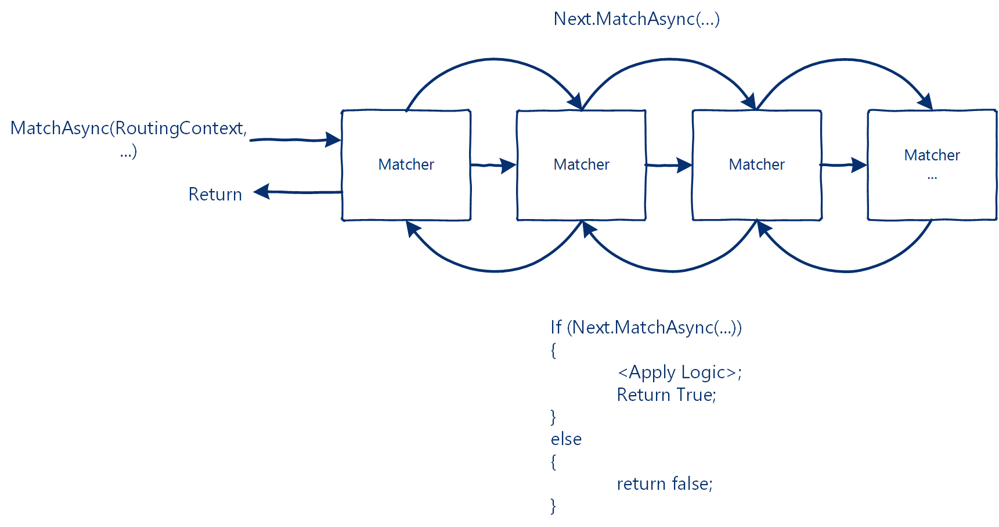

# In-Depth #

This section provides further details on how matching and strategy execution frameworks are working.

# Matching Framework #
Matching framework is an in memory tree (represented as linked list) that executes backward
```
// for example this:
var headMatcher = new HttpSetMethodMatcher(HttpMethod.Get);
headMatcher.Chain(new SetAddressListMatcher("www.microsoft.com"),
                  new HostAddressMatcher("www.bing.com", StringMatchType.UriHostandPortMatch));
// will execute HostAddressMatcher, then SetAddressListMatcher then HttpSetMethodMatcher
```



### Sequence of Events ###
Each matching component returns a boolean that represents success or fail. That means if next.MatchAsync(..) returned fall the current matching component should return false (and does not perform any matching).

Matchers must not maintain any internal state in-between-calls and must work in high concurrency multi-threaded environment. Any in-between-calls state should be maintained by the resolver. Each matching tree maintains a unique tree Id (set by the underlying framework). This tree id allows you to cache based on a tree id so for example you might have a single component that manages addresses to different sets of backends hosts. The same componet can exist in 2 different tree and caching will work successfully.  

### Each Matching Component Get: ###
1. A reference to resolver to use state in-between-calls if needed.
2. Reference to Routing Context to perform any logical needed (for example setting http method).
3. A reference to original context passed to the original routing call.
4. A reference to the original body passed to the original routing call.


Because the framework includes matchers such as:
* And: Matches 2 operands using logical "and"
* Or: Matches 2 operands using logical "Or"
* All: Matches multiple operands using logical "and"
* Any: Matches multiple operands using logical "or"
* IIF: Matches using an inline if statement

The actual matching in memory representation will look similar to:   


The above multi-purpose logical representation allows you to execute any matching logic needed and irrespective of how complex it is.

The resolver default implementation maintains a list of matching trees (in priority order). It will attempt to resolve using each tree until it finds a match (matcher returned true).  


# Execution Strategy Framework #
The router uses Execution Strategy Framework to handle errors (applying logic such as retry, changing routing etc..). The Execution Strategy Framework itself is a linked list of strategies. The router executes them one by one in response to execution errors. Each strategy returns a "Mode" which instructs the router if it should attempt a retry. The mode itself is passed to the routing context.


